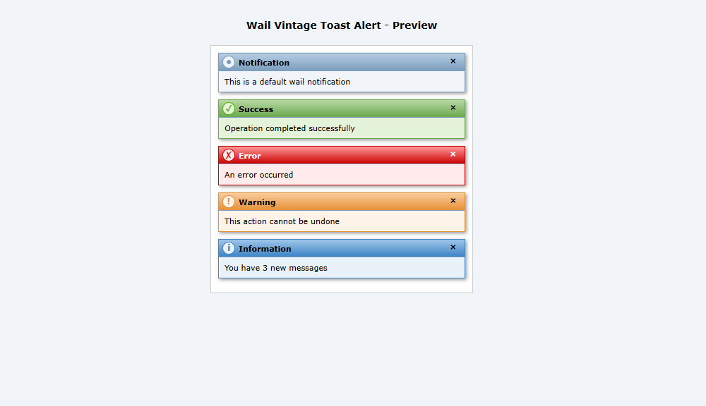

# Wail Vintage Toast Alert



Live Demo and documentation: [Check here](https://olakunlevpn.github.io/wail-vintage/)

A vintage-style jQuery notification library inspired by the classic UI design of the early 2000s. Wail Vintage Toast Alert brings back the nostalgic look and feel of web applications from that era while providing modern functionality.

## Features

- 🎨 **True Vintage Style**: Classic gradients, borders, and styling reminiscent of early 2000s web design
- 🌈 **Multiple Notification Types**: Success, Error, Warning, Info, and Default
- 📍 **Flexible Positioning**: Place notifications in any corner of the screen
- ⏱️ **Customizable Duration**: Set how long notifications stay visible
- 🔄 **Event Callbacks**: Support for onOpen, onClose, onClick, and onHover events
- 🛑 **Pause on Hover**: Notifications pause their timer when hovered over
- 📝 **HTML Content Support**: Display formatted HTML content in notifications
- 🔢 **Stack Management**: Control how many notifications can be shown at once

## Installation

Include jQuery and jQuery UI, then add Wail Vintage Toast Alert:

```html
<!-- Include jQuery and jQuery UI -->
<script src="https://code.jquery.com/jquery-1.8.3.min.js"></script>
<script src="https://code.jquery.com/ui/1.8.24/jquery-ui.min.js"></script>

<!-- Include Wail CSS and JS -->
<link rel="stylesheet" href="https://cdn.jsdelivr.net/gh/olakunlevpn/wail-vintage/assets/css/wail-vintage.css">
<link rel="stylesheet" href="https://cdn.jsdelivr.net/gh/olakunlevpn/wail-vintage/assets/css/wail-vintage-icons.css">
<script src="https://cdn.jsdelivr.net/gh/olakunlevpn/wail-vintage/assets/js/wail-vintage.js"></script>
```

## Basic Usage

```javascript
// Default notification
$.wail('This is a default wail notification');

// With title and message
$.wail({
    title: 'Notification',
    message: 'This is a default wail notification'
});

// Success notification
$.wail.success('Operation completed successfully', 'Success');

// Error notification
$.wail.error('An error occurred', 'Error');

// Warning notification
$.wail.warning('This action cannot be undone', 'Warning');

// Info notification
$.wail.info('You have 3 new messages', 'Information');
```

## Advanced Usage

### Event Callbacks

```javascript
$.wail({
    title: 'Event Example',
    message: 'This wail has event callbacks',
    type: 'info',
    onOpen: function() {
        console.log('Notification opened');
    },
    onClose: function() {
        console.log('Notification closed');
    },
    onClick: function() {
        console.log('Notification clicked');
        // You can perform actions when the notification is clicked
    },
    onHover: function() {
        console.log('Notification hovered');
    }
});
```

### HTML Content

```javascript
$.wail({
    title: 'HTML Content',
    message: '<strong>Bold text</strong> and <a href="#">a link</a>',
    escapeHtml: false
});
```

### All Configuration Options

```javascript
$.wail({
    title: 'Custom Wail',              // Title of the wail
    message: 'Custom message',         // Message content
    type: 'success',                   // Type: default, success, error, warning, info
    duration: 5000,                    // Duration in milliseconds (0 for sticky)
    position: 'bottom-right',          // Position: top-right, top-left, bottom-right, bottom-left
    showHeader: true,                  // Whether to show the header section
    showClose: true,                   // Show close button
    width: 300,                        // Width in pixels
    zIndex: 9999,                      // z-index for notifications
    onOpen: function() {},             // Callback when notification is opened
    onClose: function() {},            // Callback when notification is closed
    onClick: function() {},            // Callback when notification is clicked
    onHover: function() {},            // Callback when notification is hovered
    pauseOnHover: true,                // Pause auto-close timer when hovering
    escapeHtml: true,                  // Escape HTML in message and title
    closeOnClick: false,               // Close notification when clicked
    stack: 5                           // Maximum number of notifications (0 for unlimited)
});
```

### Clear All Notifications

```javascript
$.wail.clear();
```

## Browser Compatibility

- Internet Explorer 8+
- Firefox 3.6+
- Chrome 8+
- Safari 5+
- Opera 10.6+

## License

MIT License

## Author

Created with ❤️ by [Olakunle](https://github.com/olakunlevpn)
